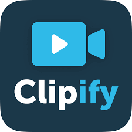

# CLIPIFY



> CLIPIFY YouTube Video Summarising Android Application usinG NLP

VideoMash is a video summarizer where in you can upload any video from local system or can provide the YouTube URL for your video to summarize it into any duration which you provide as input. Summarization is done using NLP algorithms which is used to analyze the subtitles of the video to extract the important parts. 

Read medium article : [Video summarizer made easy](https://medium.com/@aswanthkanil/video-summarizer-made-easy-using-nlp-af0afdea49b5)

We provide an Android Application that generates the summary of any video on YouTube that you want to watch quickly. We use NLP to process the subtitles of the video and give you a crunched video that encompasses all the essential parts while leaving out filler words and stop words. We compress the video and deliver to you a considerably shortened video.
This can be especially useful for students who wish to quickly go through an educational video on youtube or elsewhere and want to see if what they are looking for is available in the video. They can then decide whether or not to watch the entire video.


At the heart of the processing are the sumy and nltk libraries. These help us detect the most important parts of the subtitles and then we crop the video that has those parts.

First the text in the captions is extracted using YoutubeDL. Then the whitespaces and punctuation is removed, and sumy provides many functions for the tasks.
Next, the stopwords are extracted from the captions and removed.
After that, for each subtitle segment, a time frame is obtained i.e., time when the subtitle segment appears in the video.

The LSA summariser is a major part of the extraction of the summarised video. 
Latent Semantic Analysis(LSA) is a relatively new algorithm in NLP that combines term frequency with singular value decomposition.
“Importance” is assigned to each subtitle segment and finally the video where these “important” subtitle segments occur are cropped out of the main video and compiled into the compressed video. Segments are classified as important or not important using the LSA summariser which internally uses a Truncated Singular Value Decomposition (SVD).

## Backend Setup

- To install requirements(virtual environment recommended)
```
 pip install -r requirements.txt
```

- To Run
```
python server.py
```

## Frontend Setup

- After the Flask server is running, set the variable `backendIP` to `IP:Port` of the Flask server. Check `MainActivity.kt` for the variable.
- Change path in server.py

Now, you can go ahead and run the application on an Android phone or emulator.


